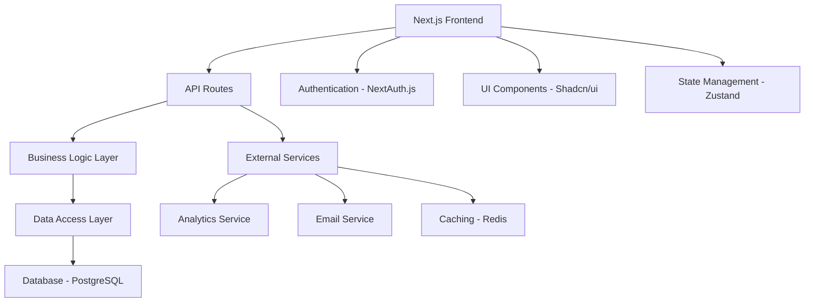

# Bitlytics System Design Document

## Overview

Bitlytics is a Next.js-based URL shortener platform that provides comprehensive analytics and user management features. The system follows modern web development practices with clean architecture patterns, TypeScript for type safety, and integrates with shadcn/ui for a beautiful, consistent user interface. The platform is designed for scalability, performance, and ease of maintenance.

## Architecture

### High-Level Architecture



### Technology Stack

- **Frontend**: Next.js 14 with App Router, React 18, TypeScript
- **UI Framework**: Shadcn/ui with Tailwind CSS
- **Authentication**: NextAuth.js with JWT tokens
- **Database**: PostgreSQL with Prisma ORM
- **State Management**: Zustand for client-side state
- **Analytics**: Custom analytics with Recharts for visualization
- **Caching**: Redis for high-performance URL redirects
- **Deployment**: Vercel (recommended) or Docker containers
- **Validation**: Zod for schema validation
- **Styling**: Tailwind CSS with custom design system

### System Architecture Patterns

- **Clean Architecture**: Separation of concerns with distinct layers
- **Repository Pattern**: Data access abstraction
- **Service Layer**: Business logic encapsulation
- **Component-Based Architecture**: Reusable UI components
- **API-First Design**: RESTful API endpoints for all operations

## Components and Interfaces

### Core Components

#### 1. URL Management System

```typescript
interface ShortUrl {
  id: string;
  shortCode: string;
  originalUrl: string;
  customCode?: string;
  title?: string;
  description?: string;
  isActive: boolean;
  expiresAt?: Date;
  createdAt: Date;
  updatedAt: Date;
  createdBy?: string;
  clickCount: number;
  uniqueClickCount: number;
}

interface UrlClick {
  id: string;
  shortUrlId: string;
  userAgent: string;
  ipAddress: string;
  country?: string;
  city?: string;
  referrer?: string;
  clickedAt: Date;
}
```

#### 2. User Management System

```typescript
interface User {
  id: string;
  email: string;
  name: string;
  avatar?: string;
  role: 'USER' | 'ADMIN';
  isActive: boolean;
  emailVerified: boolean;
  createdAt: Date;
  updatedAt: Date;
  shortUrls: ShortUrl[];
}

interface UserSession {
  user: User;
  accessToken: string;
  refreshToken: string;
  expiresAt: Date;
}
```

#### 3. Analytics System

```typescript
interface AnalyticsData {
  totalClicks: number;
  uniqueClicks: number;
  clickThroughRate: number;
  averageClicksPerDay: number;
  topReferrers: ReferrerAnalytics[];
  geographicData: GeographicAnalytics[];
  timeSeriesData: TimeSeriesPoint[];
  deviceStats: DeviceAnalytics[];
}

interface ReferrerAnalytics {
  domain: string;
  clicks: number;
  percentage: number;
}

interface GeographicAnalytics {
  country: string;
  countryCode: string;
  clicks: number;
  percentage: number;
}

interface TimeSeriesPoint {
  date: string;
  clicks: number;
  uniqueClicks: number;
}
```

### API Endpoints Structure

#### URL Management Endpoints
- `POST /api/urls` - Create new shortened URL
- `GET /api/urls` - List user's URLs with pagination
- `GET /api/urls/[shortCode]` - Get URL details and analytics
- `PUT /api/urls/[shortCode]` - Update URL settings
- `DELETE /api/urls/[shortCode]` - Delete URL
- `GET /[shortCode]` - Redirect to original URL (with analytics tracking)

#### Analytics Endpoints
- `GET /api/analytics/dashboard` - Dashboard overview
- `GET /api/analytics/urls/[shortCode]` - Detailed URL analytics
- `GET /api/analytics/export` - Export analytics data
- `POST /api/analytics/track` - Track custom events

#### User Management Endpoints
- `POST /api/auth/register` - User registration
- `POST /api/auth/login` - User login
- `POST /api/auth/logout` - User logout
- `GET /api/auth/me` - Get current user profile
- `PUT /api/auth/profile` - Update user profile

#### Admin Endpoints
- `GET /api/admin/stats` - Platform statistics
- `GET /api/admin/users` - User management
- `GET /api/admin/urls` - URL moderation
- `POST /api/admin/users/[id]/ban` - Ban user account

## Data Models

### Database Schema (Prisma)

```prisma
model User {
  id            String    @id @default(cuid())
  email         String    @unique
  name          String
  avatar        String?
  role          Role      @default(USER)
  isActive      Boolean   @default(true)
  emailVerified Boolean   @default(false)
  createdAt     DateTime  @default(now())
  updatedAt     DateTime  @updatedAt
  
  shortUrls     ShortUrl[]
  sessions      Session[]
}

model ShortUrl {
  id               String    @id @default(cuid())
  shortCode        String    @unique
  originalUrl      String
  customCode       String?
  title            String?
  description      String?
  isActive         Boolean   @default(true)
  expiresAt        DateTime?
  clickCount       Int       @default(0)
  uniqueClickCount Int       @default(0)
  
  createdBy        String?
  user             User?     @relation(fields: [createdBy], references: [id])
  clicks           Click[]
  
  createdAt        DateTime  @default(now())
  updatedAt        DateTime  @updatedAt
  
  @@index([shortCode])
  @@index([createdBy])
}

model Click {
  id          String    @id @default(cuid())
  shortUrlId  String
  userAgent   String?
  ipAddress   String
  country     String?
  city        String?
  referrer    String?
  clickedAt   DateTime  @default(now())
  
  shortUrl    ShortUrl  @relation(fields: [shortUrlId], references: [id], onDelete: Cascade)
  
  @@index([shortUrlId])
  @@index([clickedAt])
}

model Session {
  id           String   @id @default(cuid())
  userId       String
  sessionToken String   @unique
  accessToken  String   @unique
  expires      DateTime
  
  user         User     @relation(fields: [userId], references: [id], onDelete: Cascade)
  
  @@index([userId])
}

enum Role {
  USER
  ADMIN
}
```

## Error Handling

### Error Response Structure

```typescript
interface ApiError {
  success: false;
  error: {
    code: string;
    message: string;
    details?: any;
    timestamp: string;
  };
}

interface ApiSuccess<T> {
  success: true;
  data: T;
  meta?: {
    pagination?: PaginationMeta;
    total?: number;
  };
}
```

### Error Handling Strategy

1. **Client-Side**: React Error Boundaries for component-level errors
2. **API Level**: Centralized error handling middleware
3. **Database Level**: Transaction rollbacks and constraint validation
4. **User Experience**: Toast notifications and inline error messages
5. **Logging**: Structured logging with error tracking service integration

### Common Error Scenarios

- Invalid URL format validation
- Short code collision handling
- Rate limiting for URL creation
- Unauthorized access attempts
- Database connection failures
- External service timeouts

## Performance Considerations

### Frontend Optimization

- Next.js Image optimization for user avatars and previews
- Code splitting for admin vs user routes
- Service Worker for offline functionality
- CDN integration for static assets
- React.memo and useMemo for expensive computations

### Backend Optimization

- Redis caching for frequently accessed short URLs
- Database indexing for short codes and user lookups
- Connection pooling for database efficiency
- API response compression
- Rate limiting to prevent abuse

### Analytics Performance

- Batch processing for click events
- Data aggregation for dashboard queries
- Background jobs for heavy analytics computations
- Caching of frequently requested analytics data

## Security Considerations

### Authentication & Authorization

- JWT tokens with proper expiration
- Role-based access control (RBAC)
- Session management with secure cookies
- OAuth integration for social login

### Data Protection

- Input validation and sanitization
- SQL injection prevention with Prisma
- XSS protection with Content Security Policy
- Rate limiting and abuse detection
- GDPR compliance for analytics data

### Infrastructure Security

- Environment variable management
- HTTPS enforcement
- Database connection encryption
- Regular security audits and updates

## Testing Strategy

### Testing Pyramid

#### Unit Tests (70%)
- Component testing with React Testing Library
- Business logic testing with Jest
- Utility function testing
- Database model testing

#### Integration Tests (20%)
- API endpoint testing
- Database integration tests
- Authentication flow tests
- Third-party service mocking

#### End-to-End Tests (10%)
- Critical user journey tests with Playwright
- URL shortening and redirection flows
- Analytics dashboard functionality
- Cross-browser compatibility tests

### Testing Tools

- **Unit/Integration**: Jest, React Testing Library
- **E2E**: Playwright
- **API Testing**: Supertest
- **Database Testing**: Jest with test database
- **Performance Testing**: Lighthouse CI

## Monitoring and Analytics

### Application Monitoring

- Real User Monitoring (RUM)
- Core Web Vitals tracking
- API performance monitoring
- Database query performance analysis
- Error tracking and alerting

### Business Metrics

- URL creation rates
- Click-through rates
- User engagement metrics
- Geographic usage patterns
- Popular domains and referrers

This design provides a solid foundation for building Bitlytics as a scalable, maintainable, and feature-rich URL shortener platform with comprehensive analytics capabilities.
