# 🔗 Bitlytics: Complete Project Overview

## 🧩 The Big Picture: How It All Works

Bitlytics is organized as a **3-layer stack**:
1. **🎨 Frontend Layer** - User interface with React and Next.js
2. **⚙️ API Layer** - Backend logic for processing requests
3. **💾 Database Layer** - Persistent storage with PostgreSQL

---

## 🎯 PART 1: URL Shortening Magic

### Step 1: User Submits a URL
- **Form Component**: `src/app/page.tsx` -> `<UrlShortenerForm />`
- **Validation**: Ensures valid input before submission
- **API Call**: Sends POST request to `/api/urls`

### Step 2: Server Creates Short Code
- **Validation & Normalization**: Ensures URL is well-formed
- **Short Code Logic**: Uses `nanoid` for unique codes or custom codes
- **Database Entry**: Saves mapping in PostgreSQL

---

## 🔄 PART 2: Redirect System

When someone clicks a short link like `bitlytics.com/xK3mN9`, it triggers `src/app/[shortCode]/page.tsx`, using Next.js's dynamic routing.

### Redirect Process:
- **Database Lookup**: Finds original URL for the short code
- **Click Tracking**: Asynchronously logs click data
- **User Redirection**: Sends user to the original URL

### Asynchronous Analytics
- Tracks user agent, IP, referrer, and increments click count.

---

## 🗄️ PART 3: Database Architecture

Uses **PostgreSQL** for storage with these key models:

```prisma
model ShortUrl {
  id               String    @id @default(cuid())
  shortCode        String    @unique
  originalUrl      String
  customCode       String?
  isActive         Boolean   @default(true)
  clickCount       Int       @default(0)
  ...
}

model Click {
  id          String    @id @default(cuid())
  shortUrlId  String
  userAgent   String?
  ipAddress   String
  ...
}
```

---

## ⚡ PART 4: Tech Stack Highlights

### Frontend
- **Next.js 15**: React framework with server-side rendering
- **TypeScript**: Ensures reliable and safe code
- **Tailwind CSS**: Provides design consistency and utility

### Backend
- **Prisma ORM**: Marshals type-safe database interactions
- **NextAuth.js**: Manages user sessions and authentication
- **Serverless APIs**: Provides RESTful endpoints

---

## 🔧 PART 5: Feature Workflows

### Authentication
Configures user authentication using NextAuth.js with email/password and OAuth.

### User & Admin Panels
Admin panel provides insights and control over user activity and system health.

### URL & Click Tracking
Implements a robust tracking mechanism to capture click data and user interaction.

---

## 💡 PART 6: Core Logic and Business Rules

### URL Validation
Validates and potentially corrects user-entered URLs to ensure they are trackable.

### Short Code Generation
Employs `nanoid` to produce secure, collision-resistant codes.

### Analytics Recording
Asynchronously logs every click event for comprehensive reporting.

---

## 🏗️ PART 7: File and Directory Structure

```
bitlytics/
├── src/
│   ├── app/
│   │   ├── api/urls/
│   │   ├── [shortCode]/
│   │   ├── dashboard/
│   │   ├── analytics/
│   │   └── admin/
│   ├── components/
│   │   ├── ui/
│   │   └── url-shortener-form.tsx
│   ├── lib/
│   ├── types/
├── prisma/
│   ├── schema.prisma
│   └── seed.js
└── tests/
```

---

## 🔄 Data Flow Summary

```mermaid
graph LR
    A[User enters URL] --> B[Form validates input]
    B --> C[POST to /api/urls]
    C --> D[Generate short code]
    D --> E[Save to database]
    E --> F[Return short URL]
    F --> G[User shares link]
    G --> H[Someone clicks link]
    H --> I[Lookup in database]
    I --> J[Track click analytics]
    J --> K[Redirect to original URL]
```



This project overview provides a comprehensive view of Bitlytics, enabling you to understand and contribute to the system effectively. Enjoy tracing the paths of data and the processes that define this URL shortener and analytics platform!
